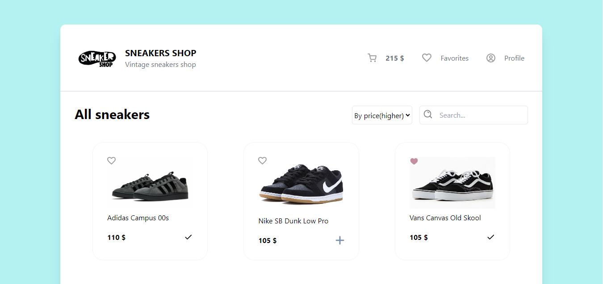
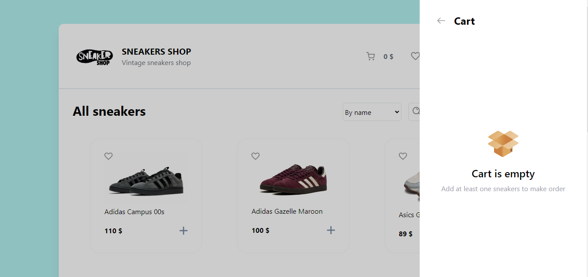
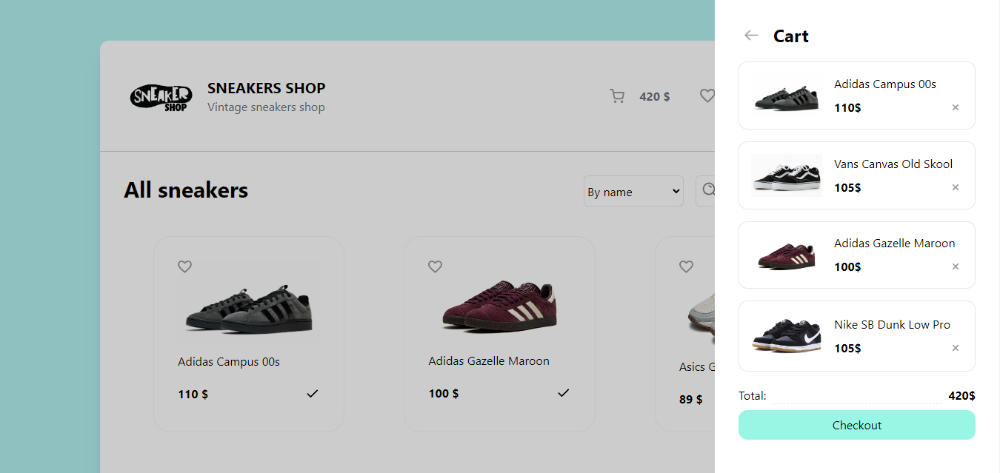
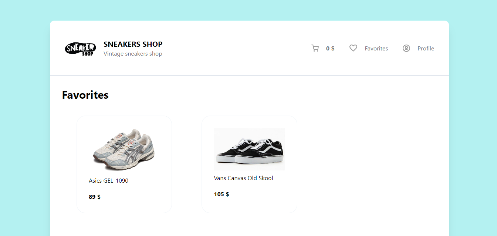

# Sneakers shop
Test sneakers sshop website for training in Vue.js framework, uses [backend](https://github.com/xdrenn/backend-sneakers)

# Tech
- Vue 3
- Vue Router
- TailwindCSS
- Axios
- @formkit/auto-animate
- Composition API / Options API

# Screenshots

